

<h1 align="center">Virtual Realm</h1>
<h4 align="center">An Augmented Reality Based Virtual Interactive Laboratory System</h4>
<h4 align="center">Created within a week as a final project of Cloud Computing Course By Ardent Computech Pvt Ltd</h4>  

- - -

---

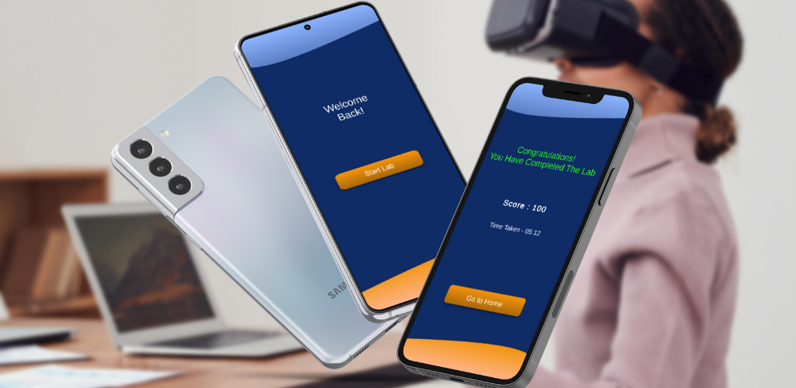 

***

### Presentation & App Link
> [📲 Click here to download the app from playstore](https://play.google.com/store/apps/details?id=com.Team2.VirtualRealm)  

> [🖥️ Click here to download pdf presentation](./docs/Virtual-Realm-Presentation.pdf.pdf)  

### Deployment 
> 🌀 Backend Server Hosted in AWS EC2 Instance
_ _ _

### Tech Stacks Used
- `In frontend`,
    - We have used Unity AR Foundation for developing the augmented reality environment
    - Blender For creating 3D models
    - AWS Polly for instruction to the user
- `In backend`,
    - we have used flask with python for the backend server
    - C# for app backend 
    - DynamoDB for database
    - AWS Cognito for authentication
* * *

### In total 2 ways, The user can acess the application !

#### `1 | Sign Up`
> 🔐 Sign Up with your email and password
> 
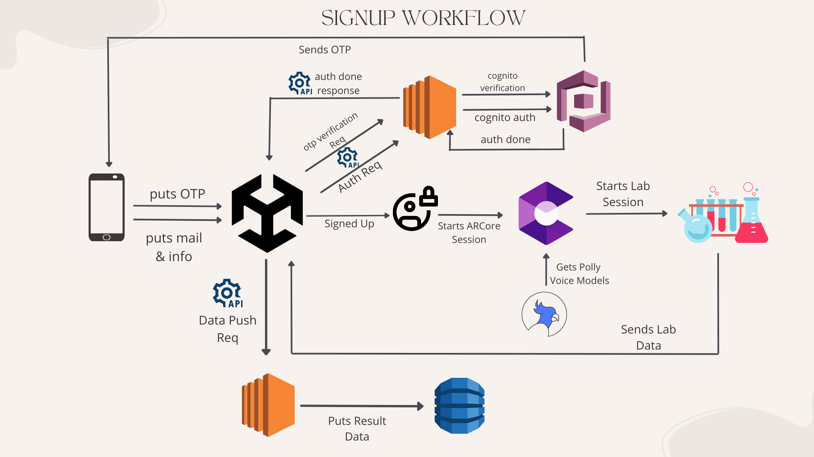 

#### `2 | Login`
> 🔐 Login with your email and password
> 
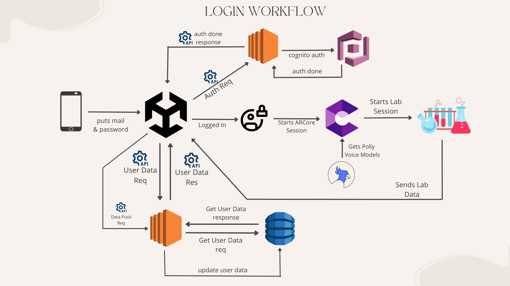

- - -

### `Full Architecture Diagram`
> 
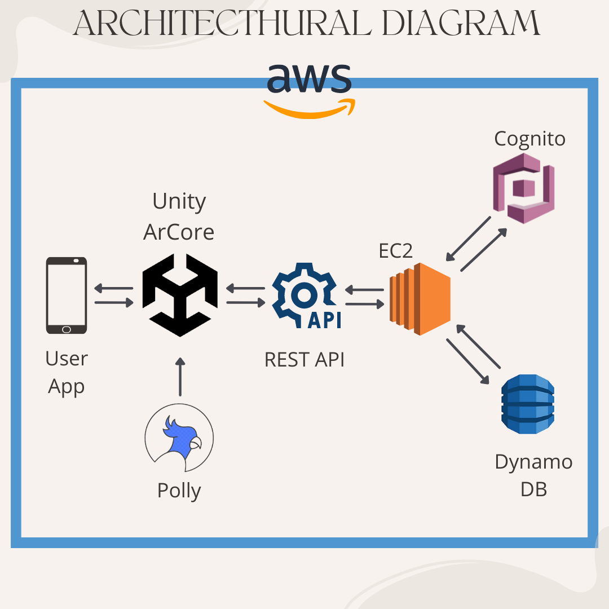 

- - -

### `Few Snaps of the Application`
> 
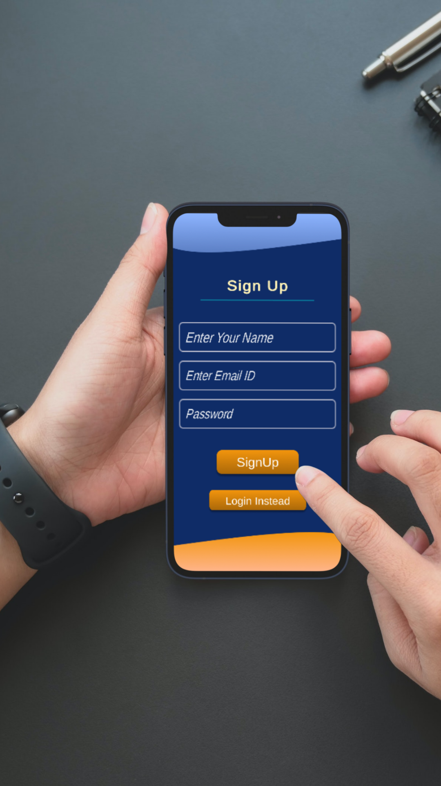 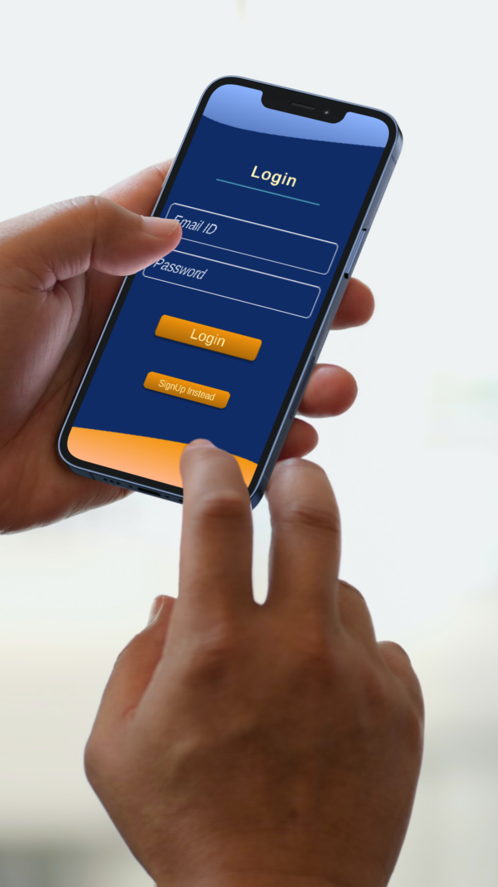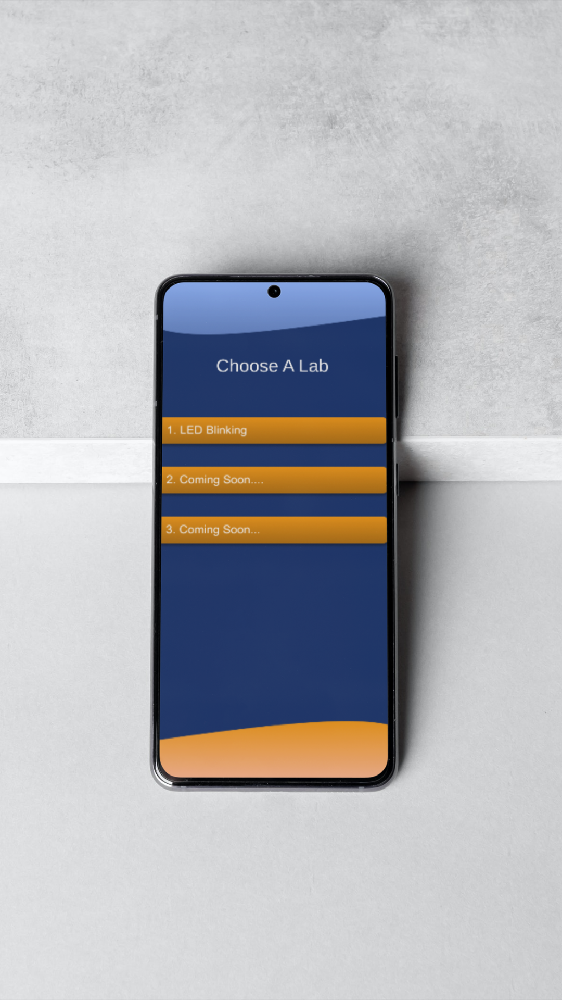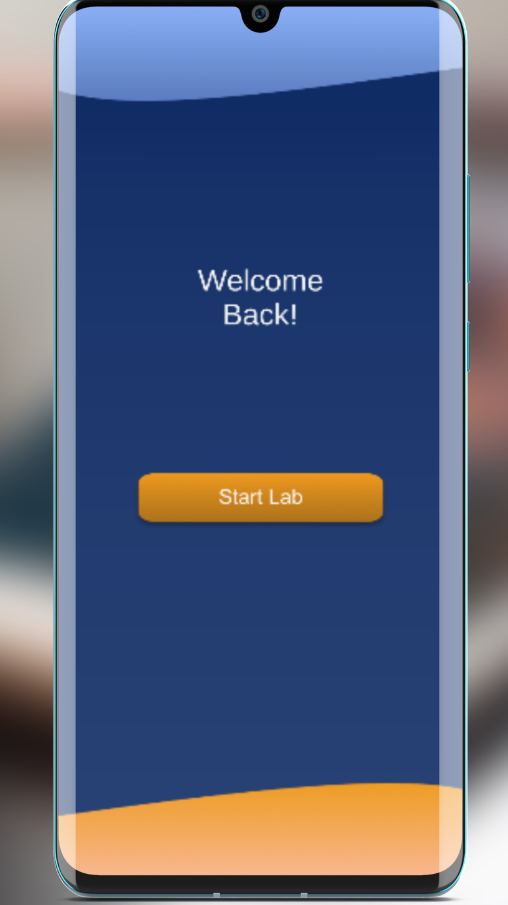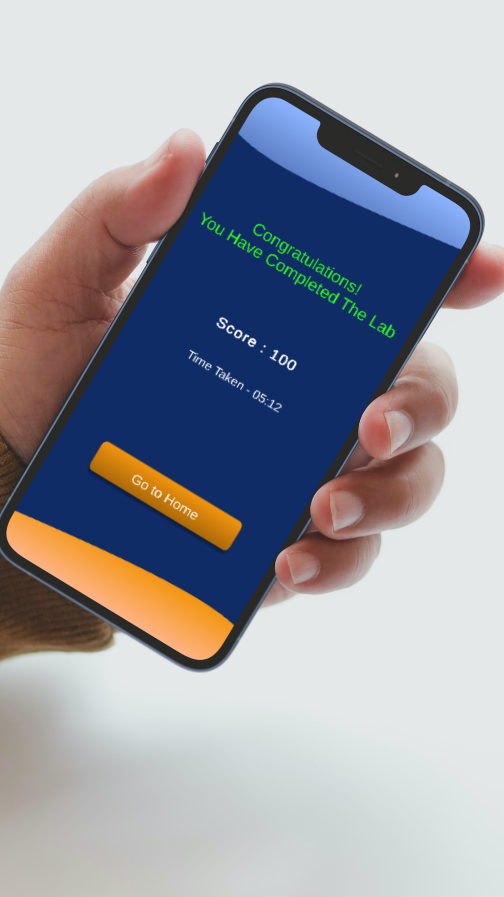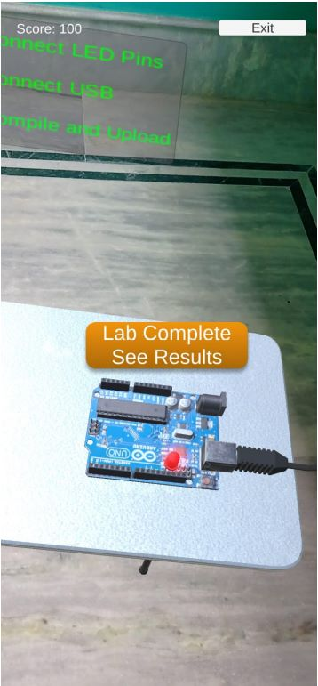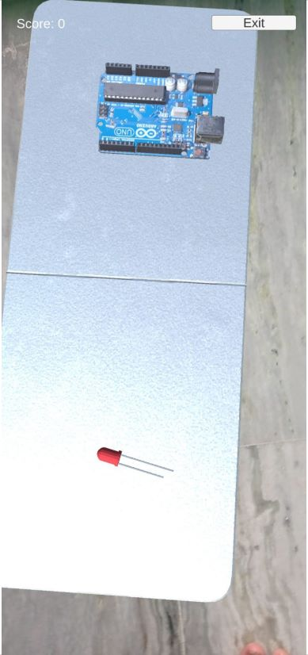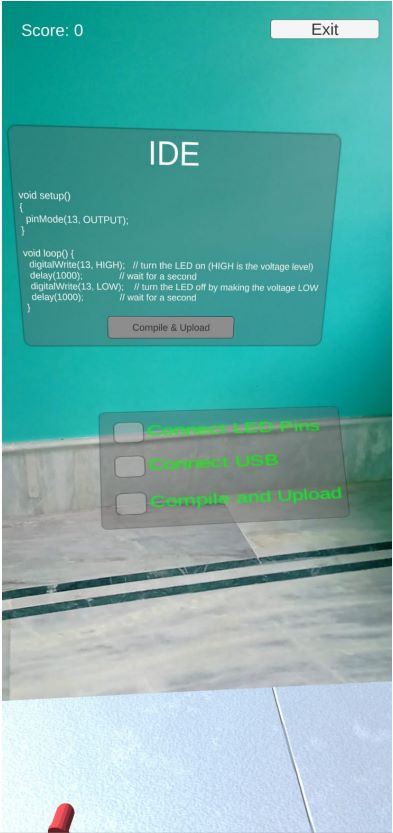

- - -
### `Demo Video`

https://user-images.githubusercontent.com/38105595/146590170-605bcba0-5cd5-414f-8012-2a714115ebd6.mp4

---

### `AWS Microservices Used`

|Service Name|Usage|
|--------------------|--------|
|`Cognito`|For Auth|
|`Polly`|For Instructions|
|`DynamoDB`|For Database|
|`Auto Scaling`|For EC2 autoscaling|
|`Elastic Load Balancing`|For EC2 load balancing|

- - -

### `Project Members`

|Member Name|Role|
|--------------------|--------|
|`Shreyam Maity`|Team Lead|
|`Sayan Ghosh`|Backend Developer|
|[Sayan Samanta](https://github.com/SayanDeveloper)|UI/UX Designer|
|`Yash Shaw`|Aws Manager|
|`Swapnanil Maity`|Active Tester|

---

#### Thanking You
*Virtual-Realm*

# 
Contributors

